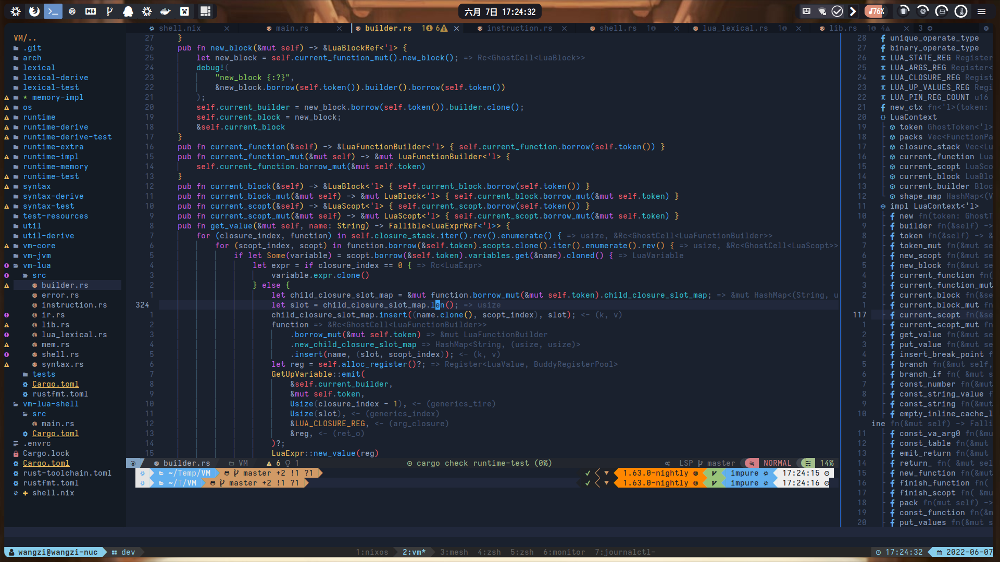
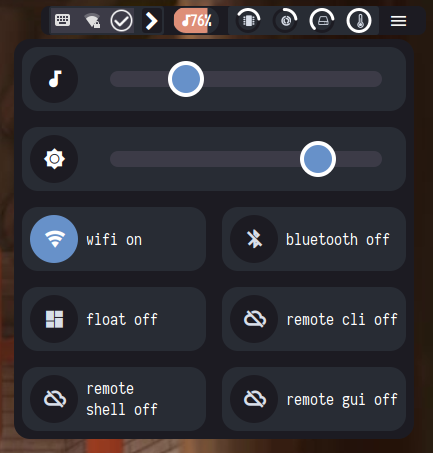
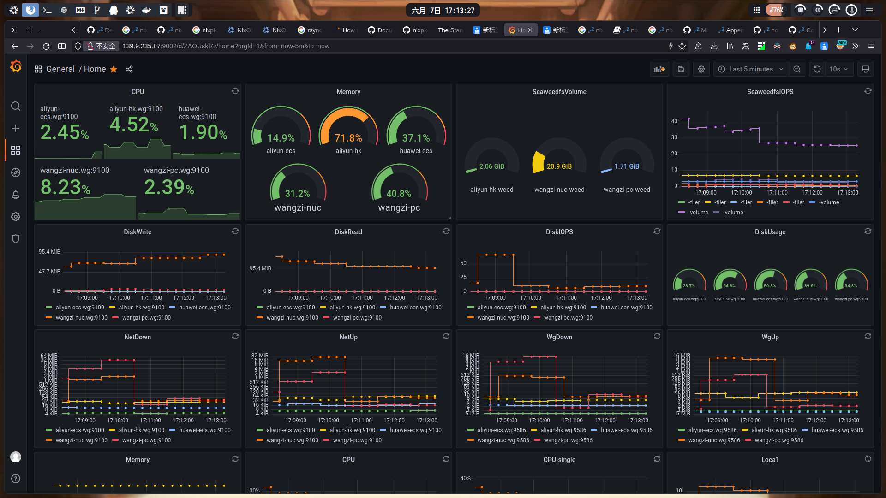

# My Personal NixOS
个人定制分布式linux操作系统,基于[NixOS](https://nixos.org/)。适用于PC,云服务器，虚拟机，LXD容器，Android 平板电脑(termux)，Android 手机(termux)。
此仓库包含系统所有配置文件，可以自动打包为ISO镜像，可以实现完全自动部署服务器节点。

## 截图

## 系统架构

## 分布式操作系统组件
- [seaweedfs](https://github.com/chrislusf/seaweedfs) 分布式文件系统
- [wireguard](https://www.wireguard.com/) 虚拟局域网
- [k3s](https://k3s.io/) 轻量级Kubernetes容器编排引擎
- [LXD](https://linuxcontainers.org/) 分布式容器引擎
- [CRIU](https://criu.org/) 进程热迁移系统

## 集群设备
- 笔记本电脑(NixOS)
- 台式PC(NixOS)
- 平板电脑(HarmonyOS+termux+nix)
- Android手机(HarmonyOS+termux+nix)
- 华为云服务器(NixOS)
- 阿里云服务器(NixOS)

## 操作系统
### 网络
设备间自动建立基于wireguard的虚拟局域网，且网络具有高安全性和高性能，网络有NAT穿透能力。
### 存储
长期在线的设备提供基于seaweedfs的高性能NAS存储服务，并且利用云服务器进行热备份。
seaweedfs客户端使用fuse挂载文件系统，客户端有持久化缓存。

性能测试 展开/收起

<pre><code> 
$ fio -numjobs=2 -direct=1 -ioengine=libaio -sync=1 -rw=randread -bs=16k -size=64G -time_based -runtime=60 -name=Fio -directory=mount
Jobs: 1 (f=1): [X(1),r(1)][100.0%][r=635MiB/s][r=40.6k IOPS][eta 00m:00s]
Fio: (groupid=0, jobs=1): err= 5 (file:io_u.c:1841, func=io_u error, error=Input/output error): pid=25468: Mon Nov 15 17:46:16 2021
  cpu          : usr=0.00%, sys=0.00%, ctx=2, majf=0, minf=20
  IO depths    : 1=100.0%, 2=0.0%, 4=0.0%, 8=0.0%, 16=0.0%, 32=0.0%, >=64=0.0%
     submit    : 0=0.0%, 4=100.0%, 8=0.0%, 16=0.0%, 32=0.0%, 64=0.0%, >=64=0.0%
     complete  : 0=50.0%, 4=50.0%, 8=0.0%, 16=0.0%, 32=0.0%, 64=0.0%, >=64=0.0%
     issued rwts: total=1,0,0,0 short=0,0,0,0 dropped=0,0,0,0
     latency   : target=0, window=0, percentile=100.00%, depth=1
Fio: (groupid=0, jobs=1): err= 0: pid=25469: Mon Nov 15 17:46:16 2021
  read: IOPS=40.6k, BW=635MiB/s (666MB/s)(37.2GiB/60001msec)
    slat (usec): min=14, max=3389, avg=23.70, stdev=26.92
    clat (nsec): min=319, max=907298, avg=403.04, stdev=902.99
     lat (usec): min=14, max=3390, avg=24.20, stdev=27.03
    clat percentiles (nsec):
     |  1.00th=[  338],  5.00th=[  342], 10.00th=[  346], 20.00th=[  350],
     | 30.00th=[  354], 40.00th=[  354], 50.00th=[  358], 60.00th=[  366],
     | 70.00th=[  374], 80.00th=[  402], 90.00th=[  548], 95.00th=[  596],
     | 99.00th=[  692], 99.50th=[ 1032], 99.90th=[ 1736], 99.95th=[ 5856],
     | 99.99th=[20352]
   bw (  KiB/s): min=615392, max=677984, per=100.00%, avg=650262.86, stdev=11238.15, samples=119
   iops        : min=38462, max=42374, avg=40641.43, stdev=702.38, samples=119
  lat (nsec)   : 500=89.38%, 750=9.82%, 1000=0.28%
  lat (usec)   : 2=0.44%, 4=0.02%, 10=0.01%, 20=0.04%, 50=0.01%
  lat (usec)   : 100=0.01%, 250=0.01%, 500=0.01%, 750=0.01%, 1000=0.01%
  cpu          : usr=3.99%, sys=12.62%, ctx=2439734, majf=0, minf=18
  IO depths    : 1=100.0%, 2=0.0%, 4=0.0%, 8=0.0%, 16=0.0%, 32=0.0%, >=64=0.0%
     submit    : 0=0.0%, 4=100.0%, 8=0.0%, 16=0.0%, 32=0.0%, 64=0.0%, >=64=0.0%
     complete  : 0=0.0%, 4=100.0%, 8=0.0%, 16=0.0%, 32=0.0%, 64=0.0%, >=64=0.0%
     issued rwts: total=2438088,0,0,0 short=0,0,0,0 dropped=0,0,0,0
     latency   : target=0, window=0, percentile=100.00%, depth=1
</code></pre>

### 桌面环境
- 基于awesomewm框架编程定制平铺式桌面
- 使用xpra访问远程应用程序
- 使用awesomewm编程定制桌面控件
- 使用alacritty终端，内部使用tmux复用终端，使用zsh。
### 开发环境
- neovim: 主要IDE
- vscode: 次要IDE
- tmux: 终端复用
- podman: 测试环境

## features
- [x] sops加密密钥
- [ ] 自动化接入新设备
- [ ] 自动容器调度
- [ ] 透明远程启动程序
