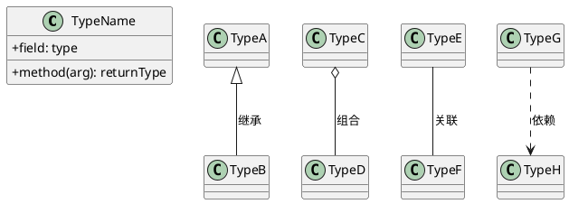
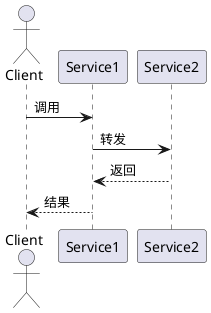

# 研究与考察结果存入笔记库 (Research to Vault)

## 概述

将研究、分析、考察结果按分类规则写入 Obsidian 笔记库 `~/Documents/Obsidian-work/`，
遵循笔记库 AGENTS.md 中定义的目录结构和模板规范。

## 触发场景

- 完成代码分析后沉淀发现
- 技术调研结论需要持久化
- 跨会话复用的知识需要入库
- 用户明确要求"记笔记"、"存入笔记库"、"记录到wiki"

## 工作流程

### Step 1: 读取笔记库规范

读取笔记库 AGENTS.md 获取最新规范：

```
obsidian_get_note(target.type="path", target.path="AGENTS.md", format="content")
```

### Step 2: 确定分类目录

根据研究内容，按照 `references/vault-structure.md` 中的分类规则图确定目标目录。

核心分类逻辑：
- 与 WPS 源码模块相关 → `wps/<子分类>/`
- 与编程语言/运行时相关 → `编程语言技术/<子分类>/`
- 与跨平台相关 → `跨平台编程/<子分类>/`
- Bug 分析 → `bugs/`
- 调试工具/workflow → 按具体内容归类
- 想法/实验 → `想法/` 或 `wps/小实验/`

### Step 3: 选择模板

根据笔记类型选择模板（定义在 AGENTS.md）：

| 内容类型 | 模板 | 位置示例 |
|----------|------|----------|
| 代码模块分析 | 代码模块模板 | `wps/<模块名>.md` |
| Bug 分析 | Bug 分析模板 | `bugs/<bug标题>.md` |
| 坑点记录 | 坑点笔记模板 | `wps/坑.md`（追加） |
| 概念/知识 | 无固定模板 | `编程语言技术/<主题>.md` |
| 想法/实验 | 无固定模板 | `想法/<主题>.md` |

### Step 4: 生成笔记内容

按模板结构生成笔记：
1. 添加 YAML frontmatter（id, aliases, tags）
2. 按模板填充各节
3. 对代码模块笔记，使用 PlantUML 绘制类图和时序图
4. 建立与已有笔记的 wikilink 连接

### Step 5: 写入笔记

使用 Obsidian MCP 写入：

```
# 创建新笔记
obsidian_write_note(target.type="path", target.path="<路径>.md", content="<内容>")

# 或追加到已有笔记
obsidian_append_to_note(target.type="path", target.path="<路径>.md", content="<内容>")

# 或追加到特定 heading
obsidian_append_to_note(
  target.type="path", target.path="<路径>.md",
  section.type="heading", section.target="<标题名>",
  content="<内容>"
)
```

### Step 6: 校验 PlantUML 语法

对包含 PlantUML 图块的笔记，写入后运行语法检查：

```
python <skill-root>/scripts/check_plantuml.py <笔记文件.md>
```

- exit code 0 = 所有 diagram 语法正确，继续下一步
- exit code 1 = 存在语法错误，必须修复后重新写入并检查
- exit code 2 = plantuml.jar 或 Java 不可用（跳过检查但发出警告）

若校验失败，根据错误提示修正 PlantUML 块的语法，重新写入笔记文件，再次检查直到通过。

### Step 7: 建立索引和连接

1. 在 `wiki/index.md` 中添加新笔记条目（如适用）
2. 与相关笔记建立双向 wikilink
3. 为笔记分配 2-3 个标签

### Step 8: 提交到 Git

```
git add "<文件路径>"
git commit -m "新增笔记: <path> <简要变更说明>"
```

## PlantUML 图规范

代码模块笔记中的 PlantUML 图遵循以下规范：

### 类图


### 时序图


PlantUML 图块使用 fenced code block 包裹（```plantuml ... ```），
不使用 `@startuml` 的 `filename` 参数。

## 注意事项

- 不要修改已有笔记的代码块内容
- 不要自引用（笔记不链接到自己）
- 笔记标题使用中文（模块名、概念名等专有名词除外）
- tags 使用小写英文，wps 相关用 `wps-<模块>` 格式
- 笔记文件名使用中文描述性名称，避免无意义的编号

## 参考

- `references/vault-structure.md` — 完整目录分类规则图和说明
- AGENTS.md（笔记库根目录）— 模板定义和编写规范
